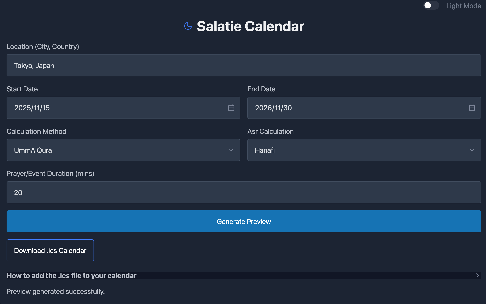
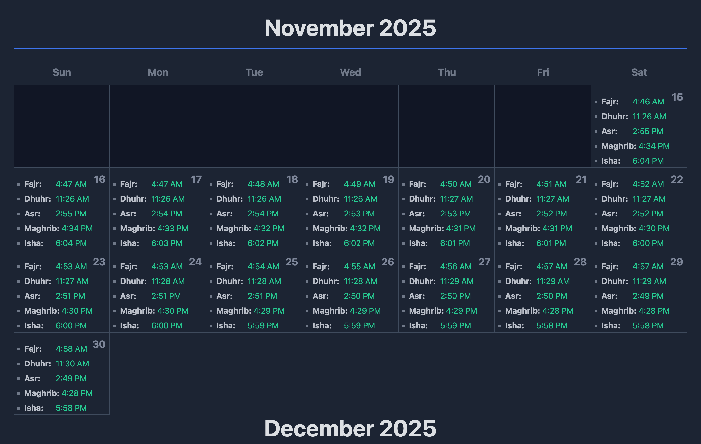
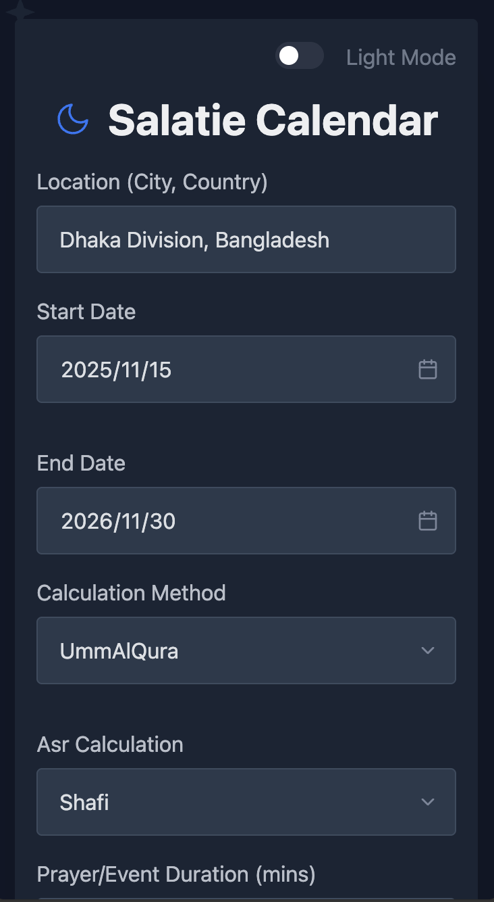
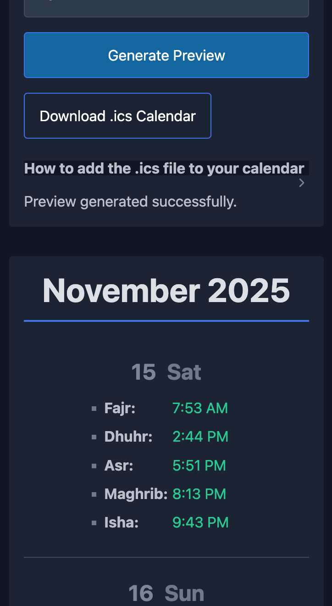

# Salatie Calendar

A simple, serverless web application for generating and exporting Islamic prayer time calendars.
Live link >>> https://salatie.quantumsofts.com

This single-page app allows users to get accurate prayer times for any location, preview them in a responsive calendar, and download an `.ics` file to import into Google Calendar, Apple Calendar, Outlook, and more.

## 📸 Screenshots
 
 

## ✨ Features

* **Accurate Prayer Times:** Uses the `adhan-js` library for precise calculations.
* **Location Search:** Find any city or country with an autocomplete search box.
* **Highly Customizable:**
    * Select any start and end date.
    * Choose from various calculation methods (Umm AlQura, Muslim World League, etc.).
    * Set Asr calculation to **Shafi (Standard)** or **Hanafi**.
    * Define a prayer duration (e.g., 10 minutes) for each calendar event.
* **Responsive Calendar Preview:**
    * A beautiful grid view for wide desktop screens.
    * A clean, centered list view for mobile and tablet devices.
* **Theme Support:**
    * Dark and Light mode toggle.
    * Loads in dark mode by default.
* **Beautiful Design:**
    * Features a subtle, embedded Islamic geometric pattern in the background.
    * Prayer times are highlighted in green (in dark mode) for readability.
* **Zero-Dependency:**
    * Runs as a single `index.html` file.
    * No server, no build process, no installation needed.

## 🚀 How to Use

This project is a single, self-contained HTML file.

1.  **Download:** Download the `index.html` file.
2.  **Open:** Open the file in any modern web browser (Chrome, Firefox, Safari, Edge).

That's it! The app is fully functional. An internet connection is only required for the location search (to convert city names into coordinates).

## 🛠️ Tech Stack

* **HTML, CSS, and JavaScript:** The core of the app.
* **[Pico.css](https://picocss.com/):** A minimal CSS framework for base styling and the theme-toggle component.
* **[Adhan-js](https://github.com/batoulapps/adhan-js):** For all prayer time calculations.
* **[ics](https://github.com/adamgibbons/ics):** For generating the `.ics` (iCalendar) file.
* **[Nominatim (OpenStreetMap) API](https://nominatim.org/):** For geocoding the location search queries.

## 🤝 Contributing

Feel free to fork this repository, open an issue, or submit a pull request. Improvements and feature suggestions are always welcome!

## 📜 License

This project is licensed under the MIT License.
